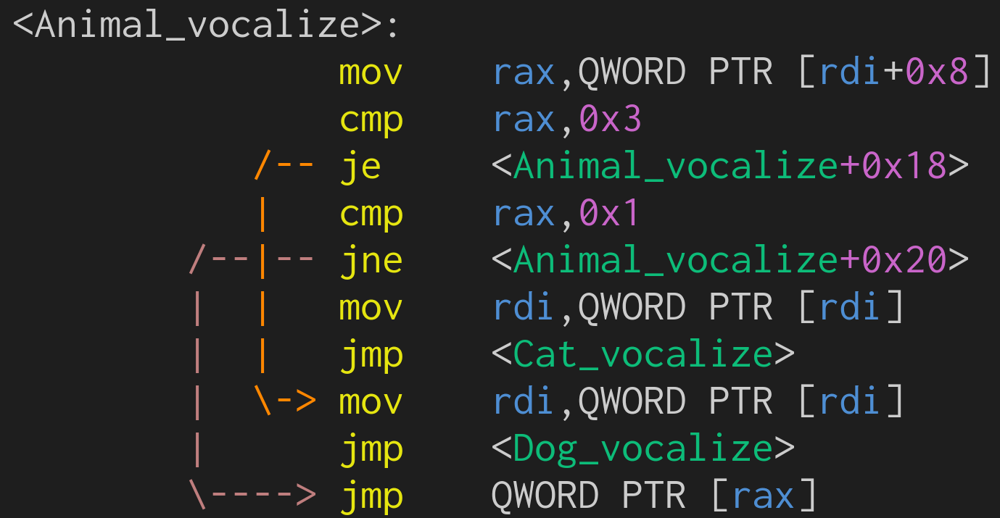

```sh
# (linux only for now)
./build.sh
```

```c
void Animal_vocalize(Animal *animal) {
  switch (animal->id) {
  case AnimalID_Cat:
    Cat_vocalize(&animal->Cat);
    break;
  case AnimalID_Dog:
    Dog_vocalize(&animal->Dog);
    break;
  default:
    animal->dynamic.vtable->vocalize(animal);
    break;
  }
}
```


